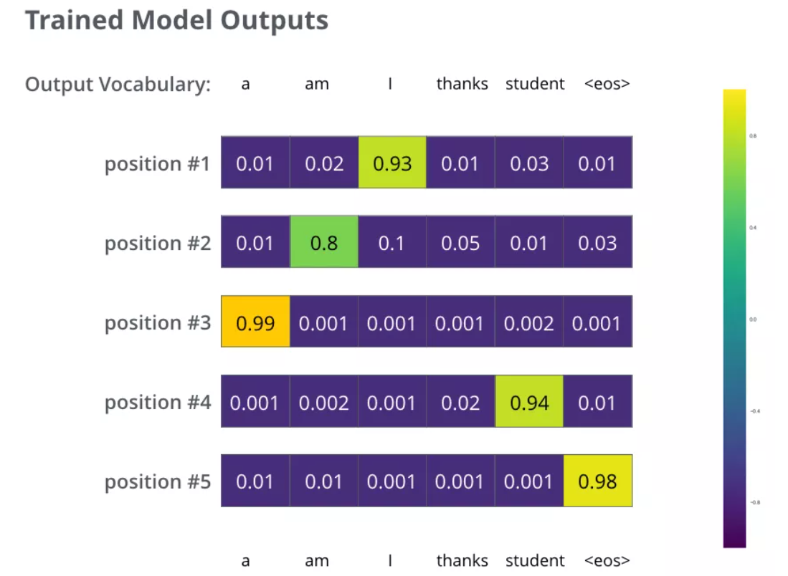

# 图解Transformer

Transformer的优点：1. 相比于RNN其可以并行运算 

Transformer的宏观结构：Seq2Seq的一种变体，最开始的任务是机翻。
原始的Seq2Seq的Encoder和Decoder是RNN，现在换成了Transformer

原论文：经过6层Encoder将最后一个Encoder分别传给6个Decoder，且Decoder按顺序与下一个Decoder进行连接

Encoder的结构：
- self-Attention
- Feed Forward Neural NetWork （FFNN：前馈神经网络）

Decoder的结构：
- self-Attention
- Encoder-Decoder Attention（Encoder的KV+Decoder的Q组成的矩阵）
- FFNN

Transformer结构细节：
输入处理：
- 词向量：
 - word embedding算法->将序列的每个词转换为词向量
 - 向量维度一般为256，512
- 位置向量
 - 对输入的每个词向量加入位置向量以确定每个单词的位置特征，或词与词之间的距离特征
 - 将这些表示位置的向量添加到词向量中，得到的新向量，可以为模型提供更多有意义的信息，比如词的位置，词之间的距离等。

 encoder：
 第一个encoder的输入是：词向量+位置向量的融合向量
 其它encdoer的输入是：上一个encoder的输出

 Self-Attention层：
 1. 对输入的词向量进行线性变换得到：Q，K，V三个向量。这三个向量是词向量分别和3个参数矩阵相乘得到，这个矩阵就是要学习的参数
 

 attention计算逻辑：q和k计算得到attention_score，然后根据attention_score与v进行加权求和

 2. 计算Attention Score：每个词向量的q与所有词向量的k进行点积运算即可得到当前词的Attention Score

 3. 将Attention Score除以一个数以为了在反向传播时求梯度能够更加稳定（有点类似于归一化），原论文除的是k向量维度的开根值

 4. 对第三步进行softmax（softmax可以将分数归一化）运算，得到每一个词向量相对于这个句子中其它词的权重

 5. 将分数与对应的v向量相乘。这种做法背后的直觉理解就是：对于分数高的位置，相乘后的值就越大，我们把更多的注意力放到了它们身上；对于分数低的位置，相乘后的值就越小，这些位置的词可能是相关性不大的。

 6. 把第五步得到的v向量相加，即可得到每个位置的对应输出
 
 (这个图是以Thinking这个单词为例)

 
 （这个图是把所有向量放在了一起）

 多头注意力机制：Transformer 的论文通过增加多头注意力机制（一组注意力称为一个 attention head），进一步完善了Self-Attention。

 - 它扩展了模型关注不同位置的能力：
 - 多头注意力机制赋予attention层多个“子表示空间”

残差连接和标准化

2层Transformer示意图：

解码器
编码器一般有多层，第一个编码器的输入是一个序列文本，最后一个编码器输出是一组序列向量，这组序列向量会作为解码器的K、V输入，其中K=V=解码器输出的序列向量表示。这些注意力向量将会输入到每个解码器的Encoder-Decoder Attention层，这有助于解码器把注意力集中到输入序列的合适位置，如下图所示。

解码（decoding ）阶段的每一个时间步都输出一个翻译后的单词（这里的例子是英语翻译），解码器当前时间步的输出又重新作为输入Q和编码器的输出K、V共同作为下一个时间步解码器的输入。然后重复这个过程，直到输出一个结束符

解码器中的 Self Attention 层，和编码器中的 Self Attention 层的区别：

- 在解码器里，Self Attention 层只允许关注到输出序列中早于当前位置之前的单词。具体做法是：在 Self Attention 分数经过 Softmax 层之前，屏蔽当前位置之后的那些位置（将attention score设置成-inf）。
- 解码器 Attention层是使用前一层的输出来构造Query 矩阵，而Key矩阵和 Value矩阵来自于编码器最终的输出。

线性层和softmaxt层：
- 线性层就是一个普通的全连接神经网络，可以把解码器输出的向量，映射到一个更大的向量，这个向量称为 logits 向量：假设我们的模型有 10000 个英语单词（模型的输出词汇表），此 logits 向量便会有 10000 个数字，每个数表示一个单词的分数。
- 然后，Softmax 层会把这些分数转换为概率（把所有的分数转换为正数，并且加起来等于 1）。然后选择最高概率的那个数字对应的词，就是这个时间步的输出单词。

损失函数：
只要Transformer解码器预测了组概率，我们就可以把这组概率和正确的输出概率做对比，然后使用反向传播来调整模型的权重，使得输出的概率分布更加接近整数输出。

那我们要怎么比较两个概率分布呢？：我们可以简单的用两组概率向量的的空间距离作为loss（向量相减，然后求平方和，再开方），当然也可以使用交叉熵(cross-entropy)]和KL 散度(Kullback–Leibler divergence)。读者可以进一步检索阅读相关知识，损失函数的知识不在本小节展开。

由于上面仅有一个单词的例子太简单了，我们可以再看一个复杂一点的句子。句子输入是：“je suis étudiant” ，输出是：“i am a student”。这意味着，我们的transformer模型解码器要多次输出概率分布向量：

- 每次输出的概率分布都是一个向量，长度是 vocab_size（前面约定最大vocab size，也就是向量长度是 6，但实际中的vocab size更可能是 30000 或者 50000）
- 第1次输出的概率分布中，最高概率对应的单词是 “i”
- 第2次输出的概率分布中，最高概率对应的单词是 “am”
- 以此类推，直到第 5 个概率分布中，最高概率对应的单词是 “<eos>”，表示没有下一个单词了
目标概率分布：

我们用例子中的句子训练模型，希望产生图中所示的概率分布 我们的模型在一个足够大的数据集上，经过足够长时间的训练后，希望输出的概率分布如下图所示：

greedy decoding和beam search的概念：
- greedy decoding:由于模型每个时间步只产生一个输出，我们这样看待：模型是从概率分布中选择概率最大的词，并且丢弃其他词。这种方法叫做贪婪解码（greedy decoding）。
- Beam search：每个时间步保留k个最高概率的输出词，然后在下一个时间步，根据上一个时间步保留的k个词来确定当前应该保留哪k个词。假设k=2，第一个位置概率最高的两个输出的词是”I“和”a“，这两个词都保留，然后根据第一个词计算第2个位置的词的概率分布，再取出第2个位置上2个概率最高的词。对于第3个位置和第4个位置，我们也重复这个过程。这种方法称为集束搜索(beam search)。